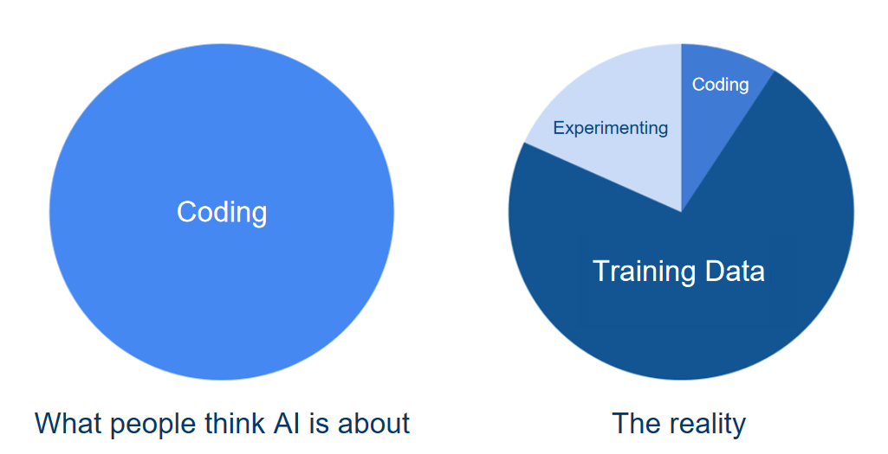

# Estratégia de IA
## Introdução a IA e Transformação Digital
A inteligência artificial (IA) refere-se ao uso de algoritmos e sistemas avançados capazes de aprender, interpretar dados complexos e realizar tarefas que normalmente exigiriam inteligência humana. Ao transformar dados em insights e ações, a IA oferece um diferencial competitivo e impulsiona a inovação.

Para empresas, a IA representa mais do que uma tecnologia avançada: é um motor de transformação que permite melhorias em várias áreas, como (mas não apenas) otimização de processos, personalização de produtos e aumento da produtividade.

> Perspectivas e Oportunidades

De acordo com a [Forbes Advisor](https://www.forbes.com/advisor/business/ai-statistics/#:~:text=72%25%20of%20businesses%20have%20adopted,more%20of%20their%20business%20functions.), 72% dos negócios hoje afirmam usar IA em ao menos uma de suas linhas de negócio, e metade deles as usam para pelo menos duas linhas de negócio.
Alguns dos principais motivos para investir diretamente em IA agora:
- **Competitividade e Inovação**: Empresas que adotam IA e Ciência de Dados estão em vantagem. Com a capacidade de processar grandes volumes de dados e responder rapidamente às mudanças do mercado, a IA permite criar produtos e serviços mais alinhados às necessidades do consumidor. Setores como finanças, saúde, varejo e manufatura já mostram resultados significativos com IA.
- **Eficiência Operacional e Redução de custos**: A IA automatiza processos repetitivos e analisa dados com rapidez e precisão, reduzindo o tempo e o custo de operações. Em setores como logística e atendimento ao cliente, isso significa reduzir custos operacionais e aumentar a eficiência, permitindo à equipe focar em atividades mais estratégicas.
- **Personalização e Experiência do Cliente**: A IA permite criar experiências personalizadas em grande escala. Com algoritmos de recomendação e atendimento personalizado, por exemplo, as empresas podem oferecer produtos e serviços personalizados, aumentando a satisfação e a retenção de clientes.

> Desafios e riscos

Apesar de grandes oportunidades de ganhos, a aplicação de IA, assim como em qualquer área da inovação, apresenta desafios e riscos, que devem ser observados e mitigados, para garantir o sucesso dos projetos e da organização como um todo.
Alguns dos principais desafios das aplicações de IA englobam:
- **Privacidade e Conformidade de Dados**: O uso de IA depende de grandes quantidades de dados, muitos deles sensíveis. A conformidade com leis de privacidade (como LGPD e GDPR) e a implementação de medidas de proteção de dados são essenciais para evitar problemas legais e éticos.
- **Vieses e Preconceitos Algorítmicos**: IA pode replicar e amplificar vieses existentes nos dados. Isso pode afetar, por exemplo, desde as decisões de recrutamento até o crédito bancário, podendo prejudicar a reputação e gerar consequências legais. Uma governança robusta e testes constantes são fundamentais para mitigar esse risco.
- **Dependência de Competências e Infraestrutura**: Implementar IA requer habilidades especializadas e infraestrutura adequada. A falta de profissionais qualificados ou de recursos tecnológicos pode limitar o potencial da IA e levar a investimentos ineficazes.

### Como IA pode impactar na Transformação digital
A aplicação de IA pode ser um componente-chave na jornada de transformação digital de uma empresa. Uma tecnologia pungente com um amplo horizonte de oportunidades de aplicação pode ser uma ferramenta essencial para alavancar suas operações.
Muitos setores já estão sendo impulsionados por IA, podemos citar alguns exemplos hoje:
- **Finanças**: IA em serviços financeiros ajuda a prever tendências de mercado, detectar fraudes e oferecer aconselhamento personalizado aos clientes.
- **Saúde**: No setor de saúde, a IA pode diagnosticar doenças mais cedo e com mais precisão, além de otimizar o atendimento ao paciente com análises preditivas.
- **Varejo**: No varejo, algoritmos de recomendação personalizados aumentam as vendas, enquanto IA em gestão de estoque ajuda a prever demandas e evitar excessos ou faltas de produtos.

## Estratégias de IA: Como fazer
Um estudo conjunto entre MIT e BCG em 2019 apontava que 90% das empresas pesquisadas já tinham feito algum investimento em IA, porém apenas 40% deste tinham visto algum ganho em seus negócios nos ultimos 3 anos.
Esta figura muda para 60% de sucesso em empresas que afirmaram investir **significantemente** em IA.
> Persistência é a chave

A primeira perspectiva de que investimentos neste setor não se traduzirem em ganhos diretos influencia diretamente em recuos significantes nos investimentos e iniciativas internas relacionadas a IA.
Este padrão porém é observado desde meados da década de 90, com a popularização da Internet: Boa parte das empresas investiram em websites e na sua presença digital, porém observaram poucos retornos durante algum tempo, os levando a desistir das iniciativas na web. As empresas porém que continuaram a investir viram retornos significativos em seus investimentos de internet.
O mesmo padrão vem se repetindo em diversas ondas como o Cloud Computing e Mobile Computing.

> Investimentos em inovação tecnologica podem demorar para mostrar retornos significativos.

Porém, no cenário altamente competitivo em que as empresas estão inseridas, é comum que investimentos precisem ser "justificados" com retornos ligeiros.
Então surge uma questão: Como equilibrar as iniciativas e investimentos em IA de forma a garantir um retorno significativo a longo prazo, e retornos ligeiros que possam incentivar a organização a continuar nos esforços nesta tecnologia?

### Abordagem de Portfólio de Projetos
Com esta abordagem, é possível equilibrar projetos de forma a ter investimentos sustentáveis em IA, e perceber incrementalmente como esta tecnologia pode impactar negócios completamente.

> Portfolio IA = Ganhos rápidos + Projetos de Longo prazo

1. **Ganhos Rápidos**: Estes serão os projetos que irão garantir que a organização sinta-se motivada a investir e já observar ganhos de valor. Também são forma importante de habituar os colaboradores à tecnologia e uma adaptação à cultura de dados.
2. **Projetos de longo prazo**: Estes serão os projetos que de fato irão mudar processos ou organizações inteiras. Complexos e completos, podem ser o pivô de uma empresa.

#### Projetos de Ganhos Rápidos
Projetos utilizando ferramentas e tecnologias já existentes, com o objetivo de incrementar eficiência ou melhorar um processo existente. Pode ser definido basicamente como a `aplicação de soluções de prateleira em pontos de contato dos colaboradores`.
Utilizar frameworks e serviços como IBM WatsonX, OpenAI Platform ou AWS Bedrock, para criar soluções rápidas que possam oferecer ganhos diretos e rápidos aos colaboradores, e incentivar uma cultura de IA dentro da organização. Também é importante apresentar estas soluções e perspectivas, para fomentar iniciativas internas de intraempreendedorismo com IA: Colaboradores que conhecem as tecnologias, podem ter insights de como aplicá-las nos seus processos diários.

#### Projetos de Longo Prazo
Estes projetos podem envolver a aplicação direta de uma equipe especializada, que irá estar em contato direto com a organização, e observando soluções completas que podem mudar o negócio. Têm o objetivo de transformar processos de ponta-a-ponta.
Soluções de prateleira não serão suficiente para estes projetos, então profissionais de ciência de dados e desenvolvedores de IA serão fundamentais para desenvolver projetos de sucesso. Também é importante denotar a necessidade de infraestrutura dedicada e competências organizacionais que favoreçam o sucesso destes projetos.

> Abordagem de Portfolio de Projetos: Google

O início da implementação de IA (Especialmente Machine Learning) na Google, foi focada em pequenos pontos, e gradualmente mudando para focar em processos completos:
1. Gmail Smart Reply: Uma pequena ferramenta de autocomplete dentro dos emails escritos no Gmail.
2. Data Center Cooling: Um algoritmo de Machine Learning para supervisionar o gerenciamento do sistema de arrefecimento de um dos seus data centers.
3. Google Photos: Uma solução completa para gerenciar fotos diretamente do smartphone, com recomendações e identificação de conteúdo, com colagens feitas automaticamente por IA.
4. Retreinamento de Colaboradores: Reorganizou suas equipes para impactar 25K colaboradores, colocando-os em equipes de Machine Learning, com um mentor durante 6 meses.

---
Faça este **exercício**:
1. Identifique na sua organização um grupo de atividades que podem ser automatizadas ou incrementadas com IA.
2. Classifique-as entre Projetos de Ganho Rápido e Projetos de Longo prazo.
3. Construa um portfólio de IA de 3 anos: 5-6 projetos de ganho rápido e 1-2 projetos de longo prazo.
4. Reflita sobre como um time de IA iria se encaixar na sua organização: Um novo setor? Parte integrante do setor de Engenharia ou TI? Profissionais distribuidos entre os times?

## Reduzindo as barreiras para o uso de IA
Historicamente, as barreiras para o uso de IA nunca estiveram tão baixas. Num passado não muito distante, eram necessários mestres e doutores com capacidade para implementar algoritmos completos e estruturas caras e dedicadas para a aplicação destes algoritmos. Hoje temos ferramentas de uso comum que aplicam IA como o famigerado ChatGPT, Claude.ai e bibliotecas que abstraem a complexidade destes algoritmos complexos como Tensorflow, AutoML, PyTorch, etc. O hardware para executar estes algoritmos e pipelines de dados estão hoje mais acessíveis que nunca, com o acesso facilitado a GPUs e TPUs (Google Colaboratory, por exemplo), fora serviços como o Groq, que facilitam o uso de hardware especializado com custos acessíveis.

### Barreira: Hardware
Existem também hoje plataformas Cloud que facilitam o uso e distribuição destes serviços, como Google Cloud Platform (GCP), AWS, Microsoft Azure, IBM Data Pak, etc.
Hardware especializado acessível em qualquer lugar do mundo, com um baixo custo, sem a necessidade de investir inicialmente em máquinas caras que serão aplicadas apenas nas novas soluções de IA.

### Barreira: Software
Ferramentas cada vez mais acessíveis para gerenciamento de dados, aplicação de modelos de IA e automação de pipelines de ciência de dados tornam a criação de soluções mais simples:
- Google TensorFlow
- Apache MXNet
- Facebook PyTorch
- Azure ML Studio
- IBM WatsonX
- AWS Bedrock
- Google Gemini
- OpenAI Platform
- Claude.ai Platform
- Hugging Face

São exemplos de bibliotecas, plataformas e ferramentas para aplicação direta de IA sem a necessidade de um conhecimento extensivo nos fundamentos matemáticos por trás da tecnologia.

### Barreira: Dados e Algoritmos
Uma questão que pode aparecer diretamente é: Para começar meu portfolio de IA, devo primeiro organizar uma equipe com profissionais especialistas?
A resposta seria obviamente sim, há 5 ou 6 anos atrás. Hoje não há essa necessidade direta em projetos de ganho rápido mais simples. A caça por talentos capacitados em IA pode ser feita de forma gradativa graças à marketplaces de dados e algoritmos.
Estes marketplaces possibilitam que o acesso à dados, de outra forma dificeis de obter, sejam acessados e usados de maneira livre, de forma simplificada. Também disponibilizam algoritmos criados, testados e melhorados por uma comunidade de especialistas de maneira *open-source*. Exemplos:
- Kaggle
- Algorithmia
- Exchange.ai

## Economia de IA
Existem, basicamente, 4 pontos de atenção quanto a economia relacionada à IA, e que vão influenciar diretamente como os investimentos serão gerenciados neste setor.

### Software
IA pode ser extremamente poderosa e útil, e é porém extremamente complexa e uma área de estudos muito ampla.
Programar uma rede neural desde seus fundamentos, por exemplo, é uma atividade complexa e que requer conhecimentos específicos e relativamente dificeis: Naturalmente, eram necessários Phds especializados na área para resolver estes problemas. Profissionais com um alto valor no mercado, e consideravelmente escassos.
Historicamente, a aplicação de IA era limitada pelo seu "preço": É muito caro para implementar algo significativo.

> A Google novamente muda o jogo: Tensorflow

Em 2015, Google lança na comunidade open-source o Tensorflow, uma biblioteca que facilita diretamente a criação de redes neurais e sua aplicação no mundo real.
Junto com ela, diversas bibliotecas e frameworks foram sendo gradativamente lançados ao mercado. 
Surgiram também diversas soluções *no-code*, onde basta inserir uma coleção de dados e algumas instruções, e é possível ter sistemas de predição ou recomendação com uma capacidade interessante, dependendo da complexidade a aplicação.

### Competência
A primeira barreira de "preço" imposta pela necessidade de profissionais altamente especializados foi reduzida pelo aparecimento de ferramentas no mercado: Um bom desenvolvedor, especialista, tem a capacidade de criar uma rede neural aplicável, e solucionar problemas com Machine Learning e IA sem a necessidade de conhecer e aplicar toda a matemática por trás disto.
Além disto, profissionais de diversas áreas agora são capazes de usar IA em seu dia-a-dia (vide ChatGPT), e também pensar em como essa tecnologia pode incrementar a sua qualidade-de-vida enquanto profissional.

### Computação e Infraestrutura
Conforme aplicações de IA foram se popularizando entre as organizações, a demanda por computação especializada ultrapassou as melhoras em hardware, ditadas pela Lei de Moore. Em resposta a isso, diversas companias começaram a investir e entregar para o mercado hardware altamente especializado para IA:
 - **Google TPU**: Tensor Processing Unit, uma espécie de CPU feita apenas para processar tensores (um vetor matemático n-dimensional, conceito matemático necessário para a aplicação de Machine Learning), que tem a capacidade de processar 15 a 30 vezes mais rápidas que uma GPU/CPU. Até 80x mais eficiente, gastando muito menos energia que unidades convencionais
 - **Groq LPU**: Language Processing Unit é uma criação da Groq, com o objetivo de ser uma unidade de processamento especializada em Modelos de Linguagem (Como ChatGPT e Llama), até 10x mais eficiente que seus concorrentes com CPU/GPU com respostas mais rápidas quando aplicado a LLMs (Large Language Models).

### Dados
A base para soluções de Machine Learning, ou mesmo aplicações de IA Generativa são **dados**. Nutrir uma cultura de dados é um ponto-chave essencial para o sucesso de qualquer organização moderna, seja para Business Intelligence e para tomadas de decisões baseadas em dados, mas também para aplicações modernas de IA.

Coleções de dados são o principal combustível para IA: Algoritmos de Machine Learning dependem de dados para serem treinados e IA generativa, apesar de pré-treinada com volumes absurdos de dados, se beneficiam **muito** de informações específicas, tanto para fine-tuning, quanto para base de soluções mais complexas como RAG (Retrieval Augmented Generation) ou soluções de agentes por contexto.

## Inovação de Processos e Produtos
Hoje, não é dificil convencer que tecnologias como *ChatGPT* podem ser extremamente valiosos para incrementar a eficiência operacional. Capacidades de analise de grandes quantidades de dados, sumarização, geração de conteúdo multimodal, etc, tem se tornado ferramentas corriqueiras para boa parte da população. Não é tão facil, porém, convencer executivos que a IA pode ser usada como um motor para alavancar inovação de produtos e processos.

### Inovação de Produtos
- Criação da Halicina: Um antibiótico gerado sinteticamente, criado por IA, capaz de solucionar o problema latente das "superinfecções". Após analisar mais de 100 milhões de compostos, pesquisadores do MIT conseguiram com apenas 3 dias, identificar um novo candidato à antibiótico: Um antibiótico não-toxico as celulas humanas, distinto em estrutura de qualquer outro tipo de antibiótico - Criado inteiramente por IA.
- IBM Watson p53: O Watson digeriu cerca de 23 milhões de artigos médicos de diversas disciplinas para encontrar informações sobre um tumor conhecido como p53 (Associado com metade de todos os tipos de cancer). Em pouco tempo, Watson foi capaz de identificar 6 proteinas desconhecidas que interagem diretamente com o p53, feito este que demoraria cerca de 6 anos de pesquisa para ser alcançado sem IA.
- Autodesk Chassis: A Autodesk buscava desenvolver um novo tipo de chassis, para isto, acoplou uma grande quantidade de sensores em um tipo antigo de chassis para medir informações como estresse, torções, temperaturas, deslocamentos, e qualquer outro tipo de informação valiosa para este tipo de projeto. O veículo foi dirigido levando-o ao limite. Após 20 milhões de data points, a IA gerou um novo modelo de chassis completamente diferente dos padrões: Estruturas que relembram ossos de mamute, assimétrico e com detalhes extremamente inovadores.

### Inovação de Processos
- Google Data Center Cooling: A Google, após coletar diversos dados sobre o sistema de refrigeração de um de seus data centers. Com isto, criou um sistema capaz de gerenciar os atuadores deste sistema de forma a otimizar a eficiencia energética e os resultados de resfriamento. Após a aplicação do sistema, o uso de energia caiu em 40%, e a sobrecarga relacionada ao consumo de energia melhorou em 15%.
- Amazon: Aplicação de Machine Learning para criar sistemas de recomendação de produtos para seus clientes.
- Seguros: Empresas de seguros aplicando Machine Learning para evoluir o processo de análise dos clientes para melhorar o suporte e velocidade de avaliação.

## Fatores Organizacionais e Cultura
A forma como as empresas se organizam influenciam diretamente no sucesso de projetos de inovação e de tecnologias estado-da-arte como IA. Algumas empresas estão acostumadas com cenários voláteis e projetos em meios caóticos, outras porém são menos flexíveis e mais aversas ao risco. Cabe a você explorar os fatores da organização e entender como organizar-se para execução de cada projeto, tendo em vista a estratégia principal e como a organização de Portfólio de Projetos de IA visa facilitar a adoção e execução destes projetos.
Uma questão interessante a pensar é quanto a Centralização da equipe de execução dos projetos: Vale a pena centralizar ou descentralizar?

| Descentralização                                           | Centralização                                              |
|------------------------------------------------------------|------------------------------------------------------------|
| Melhor para avaliar o mercado local e "conhecimento tácito"| Inovação disruptiva aplicável além de grupos de pesquisa individuais |
| Mais envolvido com operações e identifica problemas e soluções alternativas | Busca ampla por informações externas além dos grupos individuais |
| Não facilita a coordenação entre departamentos             | Supera a falta de coordenação entre departamentos         |

Importante denotar que estruturas descentralizadas tendem a se beneficiar com mais facilidade de investimentos em IA e Inovação. Organizações com estrutura de inovação descentralizadas são mais prováveis em adotar IA e Data Analytics, e são 3% mais produtivas quando investem em inovação descentralizada e IA concomitamente.

## Monitoramento, avaliação e Métricas de Sucesso para IA
Como qualquer tecnologia, IA evolui e suas aplicações devem ser constantemente acompanhadas e avaliadas, principalmente como forma de medir os *esforços X retornos* dos projetos, e medir também se as soluções estão performando de maneira satisfatória, ou se o produto esta se degradando e perdendo utilidade.
Além do mais, implementar serviços de IA vai muito além de apenas desenvolver um modelo, alocá-lo em uma cloud e disponibilizar para os clientes. Existem uma série de riscos e oportunidades que devem ser acompanhadas de perto:
1. Garantir a Precisão e Desempenho do Modelo: Modelos de IA podem perder precisão ao longo do tempo, um fenômeno conhecido como "decadência do modelo". Isso ocorre quando o modelo não é mais capaz de capturar adequadamente o padrão dos dados devido a mudanças no comportamento dos usuários ou nas condições de mercado.
2. Mitigar Riscos e Vieses: A IA pode amplificar vieses existentes nos dados, o que pode gerar consequências negativas para a organização e para os clientes. A avaliação contínua permite identificar e corrigir esses vieses, garantindo a justiça e conformidade do sistema.
3. Ajustar e Melhorar o ROI: O monitoramento e a avaliação permitem que a organização meça o retorno sobre o investimento (ROI) da IA, ajudando a justificar os investimentos e a ajustar a estratégia para maximizar o impacto financeiro e operacional.

### Principais métricas para Avaliar o Sucesso de IA
1. Métricas de Desempenho do Modelo
Essas métricas avaliam a precisão e a capacidade do modelo de IA de executar sua tarefa com eficácia:
- Acurácia: Mede a porcentagem de previsões corretas em relação ao total de previsões realizadas. É fundamental para modelos de classificação e outros que precisam de alta precisão.
- Precisão e Recall: Indicadas para situações onde há um balanceamento entre minimizar falsos positivos (precisão) e falsos negativos (recall). Muito utilizadas em áreas como diagnóstico médico ou detecção de fraude, onde erros de um tipo podem ser mais prejudiciais do que de outro.
- F1 Score: Combina precisão e recall em uma única métrica, oferecendo uma visão equilibrada do desempenho em casos onde há necessidade de balanceamento entre ambos.
- Erro Médio Absoluto (MAE) e Erro Quadrático Médio (MSE): Utilizados em modelos de regressão, que preveem valores contínuos. Essas métricas indicam a média dos erros cometidos pelo modelo.

2. Métricas Operacionais
Essas métricas avaliam a eficiência do modelo no contexto operacional e sua viabilidade para o negócio:
- Latência: Mede o tempo de resposta do modelo, ou seja, quanto tempo ele leva para processar uma entrada e fornecer uma saída. É crucial em aplicações onde o tempo de resposta impacta diretamente a experiência do usuário, como em sistemas de recomendação em tempo real.
- Tempo de Processamento: Relaciona-se ao custo computacional e pode ajudar a otimizar recursos e reduzir custos de infraestrutura.
- Custo de Implementação e Manutenção: Avalia o custo total da execução do modelo, incluindo o treinamento, atualizações e manutenção, permitindo que a organização monitore o custo-benefício do modelo ao longo do tempo.

3. Métricas de Impacto no Negócio
Essas métricas mensuram o valor que o modelo de IA está efetivamente gerando para a organização:
- Retorno sobre Investimento (ROI): Compara o valor gerado pela IA em relação ao custo de desenvolvimento e manutenção. Um ROI positivo indica que a IA está gerando valor financeiro, justificando o investimento.
- Taxa de Conversão: No caso de modelos que influenciam diretamente as decisões dos clientes, como recomendadores de produtos, a taxa de conversão mede o impacto das previsões de IA no comportamento do usuário.
- Engajamento do Cliente: Avalia se a IA está aumentando o engajamento do cliente, como o tempo gasto na plataforma ou a interação com funcionalidades específicas recomendadas pelo modelo.
- Save/Redução de Custos: Mede a redução de custos operacionais atribuída à IA, como automação de processos ou otimização de recursos.

4. Métricas de Conformidade e Ética
Com o aumento da regulamentação em torno da IA, é essencial monitorar métricas que garantam conformidade e práticas éticas, e isto é explicado em mais detalhes no Playbook de Governança de IA:
- Transparência e Explicabilidade: Medidas de quão interpretável é o modelo de IA para humanos. Isso é particularmente importante em setores regulamentados, como o financeiro e de saúde, onde decisões automatizadas podem precisar ser explicadas.
- Taxa de Viés: Avalia se o modelo está mostrando sinais de vieses indesejáveis que possam discriminar determinados grupos de usuários. Modelos com taxas altas de viés podem prejudicar a reputação da empresa e infringir leis de discriminação.
- Conformidade com Regulamentos de Privacidade: Verifica se o modelo está em conformidade com leis de proteção de dados (como LGPD ou GDPR), garantindo que dados sensíveis dos usuários estão sendo usados de forma responsável.

### Ferramentas e Práticas para o Monitoramento Contínuo
Interessados em aplicar projetos de IA devem estar cientes das ferramentas e práticas que facilitam o monitoramento e a avaliação contínuos:
- Implementação de Pipelines de Monitoramento Automatizado: Pipelines que monitoram continuamente a performance e alertam quando há degradação do modelo. Ferramentas como MLflow, TensorFlow Extended (TFX) e DataRobot oferecem funcionalidades de monitoramento em tempo real.
- Feedback do Usuário: Coletar feedback dos usuários sobre a precisão e a eficácia do sistema de IA permite ajustar o modelo de acordo com as necessidades reais do mercado.
- Monitoramento de Drift de Dados: Ferramentas que monitoram mudanças nos dados de entrada (data drift) e nos padrões de comportamento dos usuários podem identificar rapidamente quando o modelo precisa ser recalibrado.
- Auditorias Regulares de IA: Realizar auditorias periódicas para avaliar os resultados das métricas de conformidade e ética. Essa prática não só ajuda a manter o modelo alinhado com os valores da empresa, como também garante que ele continue em conformidade com regulamentações emergentes.
